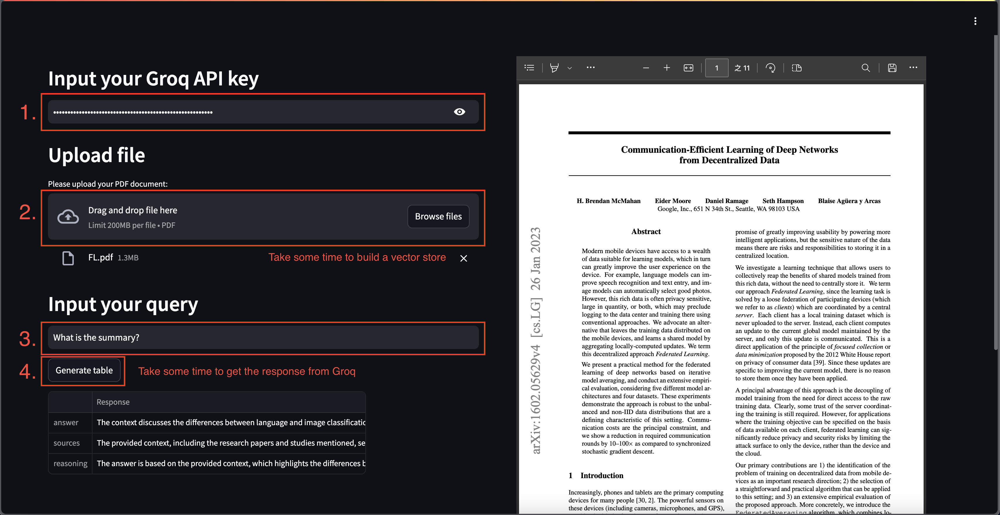
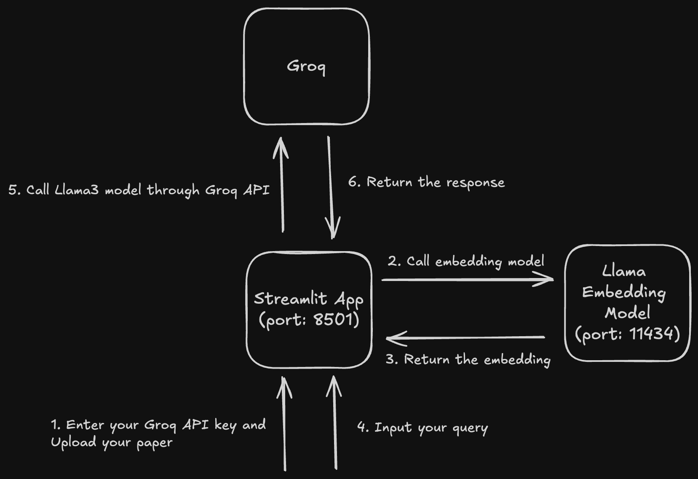

# Ollama Paper Reader

## Description
Ollama Paper Reader is a Streamlit-based web application designed to help users quickly understand academic papers using large language model(LLM). The app leverages Llama3 and the GROQ API for model inference. Users can upload their papers, and the app will process and summarize key points using retrieval-augmented generation(RAG) to provide better contextual responses from the model.

## Prerequisites
- Docker
- Groq API Key: Please apply a Groq API key for free in [Groq](https://console.groq.com/keys).

## Installation
1. Build the Docker image:
    ```bash
    docker-compose up
    ```

## Usage


## Framework


## Reference
- [Extracting Structured Data From PDFs | Full Python AI project for beginners (ft Docker)](https://youtu.be/EFUE4DHiAPM?si=vZlRjOxg3zjTmSaZ)
- [Groq](https://console.groq.com)
- [Ollama](https://ollama.com/)
